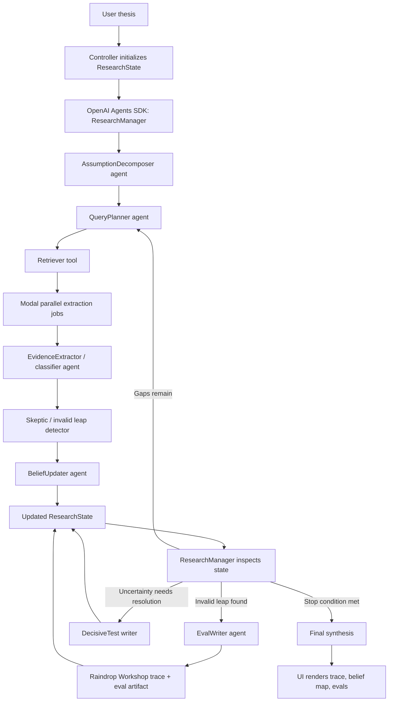

# PRD: Pragmatic

## Summary

Pragmatic is an autoresearch agent for evaluating whether a technical thesis is actually supported by evidence. It decomposes a thesis into assumptions, searches a prepared evidence corpus, classifies evidence quality, detects invalid inference leaps, updates a belief graph, proposes decisive tests, and turns its own reasoning failures into evals.

The MVP should demonstrate a visible research-state machine, not a chatbot or report generator.

The MVP must use three required infrastructure layers:

| Layer | Required Tool | Role |
|---|---|---|
| Orchestration | OpenAI Agents SDK | Runs the research controller and specialist agents/tools |
| Parallel extraction | Modal | Fans out evidence extraction/classification across source snippets |
| Observability and evals | Raindrop Workshop | Captures traces and turns detected failures into eval artifacts |

## Core Question

Primary demo thesis:

> Graph-based AI scientist systems can accelerate real materials discovery.

The product should distinguish between:

| Claim Type | Example | Desired Treatment |
|---|---|---|
| Retrieval/reasoning support | Graph memory improves scientific context management | May be medium confidence |
| Discovery support | System accelerates real materials discovery | Requires much stronger evidence |
| Proxy evidence | Benchmark QA performance | Cannot be treated as direct discovery evidence |
| Decisive evidence | Prospective validation or objective verifier loop | Strongest support |

## User Problem

Autonomous research systems often produce persuasive reports, but it is hard to tell whether they are doing actual research. Users need a way to inspect the reasoning state: what must be true, what evidence exists, what is merely proxy evidence, where the inference chain breaks, and what test would actually resolve uncertainty.

## Target Users

- AI researchers evaluating autonomous research systems.
- Founders/investors assessing technical claims.
- Hackathon judges looking for a clear demo of agentic research beyond report writing.
- Internal teams building evals for research agents.

## Product Principle

Pragmatic does not answer "is this thesis true?" with a polished essay.

It answers:

> What is the current structured research state of this thesis?

## Core Objects

`ResearchState` is the central product object.

It contains:

| Object | Purpose |
|---|---|
| `Thesis` | User's technical claim |
| `Assumption` | Things that must be true for the thesis to hold |
| `ResearchQuestion` | Questions needed to investigate assumptions |
| `Source` | Retrieved corpus item |
| `EvidenceItem` | Typed evidence extracted from a source |
| `InvalidLeap` | Detected unsupported inference |
| `BeliefUpdate` | Change in support/confidence |
| `DecisiveTest` | Test that would reduce uncertainty fastest |
| `GeneratedEval` | Eval created from a reasoning failure |
| `TraceEvent` | Timeline event for UI/debugging |

## System Architecture



## Architectural Rule

Agents and tools produce typed artifacts.

The OpenAI Agents SDK `ResearchManager` chooses the next action.

The UI only reads `ResearchState`.

This prevents modules from calling each other chaotically and keeps the system inspectable.

## Required Stack Responsibilities

### OpenAI Agents SDK

The OpenAI Agents SDK is the required orchestration layer. It should own the visible research loop and expose each specialist step as an agent or tool.

Required agents/tools:

| Agent/Tool | Responsibility |
|---|---|
| `ResearchManager` | Owns the loop, inspects `ResearchState`, decides next action |
| `AssumptionDecomposer` | Turns thesis into assumptions and evidence requirements |
| `QueryPlanner` | Generates initial and follow-up research questions |
| `RetrieverTool` | Retrieves local corpus sources for research questions |
| `EvidenceExtractor` | Extracts typed evidence from source snippets |
| `Skeptic` | Detects invalid inference leaps |
| `BeliefUpdater` | Updates support levels and confidence |
| `DecisiveTestWriter` | Proposes tests that would reduce uncertainty fastest |
| `EvalWriter` | Converts reasoning failures into eval definitions |

### Modal

Modal is the required parallel evidence-extraction layer. The local app/controller should batch source snippets and fan them out to Modal workers for extraction and classification.

Required behavior:

- Accept source snippet plus relevant assumptions.
- Return `EvidenceItem`-compatible objects.
- Preserve source IDs and assumption IDs.
- Support deterministic fallback behavior for demo reliability if external calls fail.
- Emit extraction metadata for tracing, including source ID, worker status, and evidence count.

### Raindrop Workshop

Raindrop Workshop is the required observability and failure-to-eval layer.

Required behavior:

- Record the research trace from `ResearchManager` through specialist agents/tools.
- Highlight evidence-classification decisions and belief updates.
- Capture invalid leap detections as trace events.
- Persist generated evals from `EvalWriter`.
- Support a replay story where a detected failure changes future classification behavior.

## MVP Flow

1. User enters a thesis.
2. System decomposes the thesis into assumptions.
3. System generates evidence requirements.
4. System creates research questions.
5. System retrieves matching local corpus sources.
6. System extracts typed evidence items.
7. System classifies evidence as direct, indirect, proxy, anecdotal, contradictory, or irrelevant.
8. System detects invalid inference leaps.
9. System updates confidence for each assumption.
10. System proposes decisive tests.
11. System writes at least one eval from a detected failure.
12. UI displays the full trace.

## Controller Pseudocode

```text
initialize ResearchState from thesis
start Raindrop trace

ResearchManager calls AssumptionDecomposer
ResearchManager calls QueryPlanner

while iteration < max_iterations:
    ResearchManager calls RetrieverTool for open questions
    ResearchManager sends source batches to Modal extraction jobs
    Modal workers return typed evidence candidates
    ResearchManager calls EvidenceExtractor/classifier as needed
    ResearchManager calls Skeptic to detect invalid inference leaps
    ResearchManager calls BeliefUpdater

    if unresolved assumptions remain:
        ResearchManager calls QueryPlanner for follow-up questions

    if invalid leaps were found:
        ResearchManager calls EvalWriter
        Raindrop records generated evals

    if stop condition is met:
        break

ResearchManager calls DecisiveTestWriter
close Raindrop trace
render ResearchState
```

## MVP Demo Thesis

Input:

> Graph-based AI scientist systems can accelerate real materials discovery.

Expected assumptions:

| ID | Assumption |
|---|---|
| A1 | Graph memory captures useful scientific structure |
| A2 | The system retrieves better context than standard RAG |
| A3 | The system generates non-obvious hypotheses |
| A4 | The hypotheses are testable |
| A5 | Benchmarks correlate with real scientific value |
| A6 | There is prospective validation |
| A7 | The system beats strong baselines |
| A8 | Results generalize beyond cherry-picked examples |

## Invalid Leap Patterns

The MVP should hard-code high-signal leap detectors for reliability.

| Leap | Why Invalid |
|---|---|
| Benchmark QA performance -> real scientific discovery | Benchmarks are proxy evidence unless tied to prospective validation |
| Plausible hypotheses -> useful novel hypotheses | Plausibility does not imply novelty, testability, or value |
| Retrospective rediscovery -> prospective discovery | Rediscovery is weaker than forward prediction and validation |
| Graph representation -> mechanistic understanding | Graphs can encode associations without causal structure |
| Company claim -> validated outcome | Marketing claims require independent evidence |

## Belief Model

Each assumption has:

| Field | Meaning |
|---|---|
| `support_level` | `strong`, `moderate`, `weak`, `unsupported`, `contradicted`, `unknown` |
| `confidence` | Numeric value from 0.0 to 1.0 |
| `evidence_needed` | What would change confidence |
| `latest_update` | Why support changed |

The system should be conservative. Proxy evidence can improve confidence in adjacent claims, but should not strongly support the central discovery claim.

## Evidence Types

| Type | Meaning |
|---|---|
| Direct | Directly supports the assumption |
| Indirect | Supports an adjacent claim |
| Proxy | Measures something related but not decisive |
| Anecdotal | Example or claim without systematic validation |
| Contradictory | Pushes against the assumption |
| Irrelevant | Does not bear on the assumption |

## UI Requirements

The UI should feel like a research observability dashboard.

Required sections:

| Section | Content |
|---|---|
| Thesis input | Text box plus "Run Pragmatic" button |
| Research timeline | Ordered trace of decomposition, retrieval, extraction, skepticism, belief update |
| Assumption map | Table of assumptions, support, confidence, evidence gaps |
| Evidence table | Source, evidence type, claim supported, limitation |
| Invalid leaps | Prominent cards explaining detected inference failures |
| Belief updates | Before/after confidence changes |
| Decisive tests | Specific experiments or evals that would resolve uncertainty |
| Generated evals | Failure, root cause, eval rule, expected behavior |

Invalid leaps should be visually prominent. That is the demo moment.

## Replay Requirement

The MVP should support a lightweight before/after story through Raindrop Workshop.

First pass:

> Benchmark evidence is tempting and may be overcredited.

Correction:

> Pragmatic flags the invalid leap and writes an eval.

Replay:

> Benchmark evidence is classified as proxy, and confidence in real discovery acceleration is downgraded.

This should be implemented with a real trace/eval artifact in Raindrop Workshop. The classification logic may remain deterministic for demo reliability, but Raindrop is required for observability and the failure-to-eval story.

## Generated Eval Example

```text
Failure observed:
The system accepted benchmark QA evidence as strong support for real-world discovery acceleration.

Root cause:
It conflated proxy benchmark performance with direct evidence of scientific discovery.

Eval rule:
If evidence only reports benchmark QA performance, classify it as proxy evidence, not direct evidence.

Expected behavior:
The agent should downgrade support for real-world discovery claims and ask for prospective validation evidence.
```

## Data Requirements

Use a local JSON corpus for the hackathon MVP.

Corpus should include 10-20 curated snippets covering:

| Category | Purpose |
|---|---|
| AI scientist papers | Support autonomous research framing |
| Graph-RAG / graph-agent papers | Support graph memory and retrieval assumptions |
| Scientific QA benchmarks | Provide tempting proxy evidence |
| Company/blog claims | Provide anecdotal/marketing evidence |
| Critiques/limitations | Surface gaps |
| Benchmark descriptions | Clarify what is actually measured |
| Prospective validation examples, if any | Separate strongest evidence from weaker evidence |

## Non-Goals

- Do not build user auth.
- Do not build a generic chat UI.
- Do not build complex web crawling.
- Do not build full PDF ingestion.
- Do not overinvest in graph visualization.
- Do not pitch "multi-agent" as the main feature.
- Do not generate a report without exposing research state.
- Do not treat OpenAI Agents SDK, Modal, or Raindrop Workshop as optional stretch goals.

## Success Criteria

The MVP succeeds if a viewer can see:

1. A thesis become assumptions.
2. Assumptions become research questions.
3. Sources become typed evidence.
4. Proxy evidence gets separated from direct evidence.
5. Invalid inference leaps are detected.
6. Beliefs are updated conservatively.
7. A decisive test is proposed.
8. A reasoning failure becomes an eval.
9. OpenAI Agents SDK orchestrates the research loop.
10. Modal runs parallel evidence extraction/classification.
11. Raindrop Workshop records the trace and generated eval.

## Demo Script

"Everyone here is building autonomous research systems. Pragmatic asks whether those systems are actually doing research or producing plausible reports. It takes a technical thesis, decomposes it into assumptions, searches evidence, detects invalid inference leaps, updates belief state, and turns mistakes into evals."

Then show:

1. Thesis input.
2. Assumptions.
3. Evidence retrieval.
4. Invalid leap detection.
5. Belief downgrade.
6. Decisive test.
7. Generated eval.
8. Replay behavior.

## Milestones

1. Define schemas and deterministic local corpus.
2. Implement OpenAI Agents SDK `ResearchManager` and specialist agents/tools.
3. Implement Modal parallel extraction jobs with deterministic fallback.
4. Implement Streamlit UI with timeline, assumptions, evidence, invalid leaps, evals.
5. Integrate Raindrop Workshop tracing for the full research loop.
6. Implement failure-to-eval generation and Raindrop eval persistence.
7. Implement replay demo for proxy evidence correction.

## Open Questions

- Should the MVP show only one thesis deeply or several theses shallowly?
- Should replay be literal rerun behavior or a simulated before/after panel?
- Should confidence updates be numeric, categorical, or both?
- Should the corpus use real citations only, or allow clearly marked demo snippets?
- Should the decisive test point toward expert review, objective simulator/verifier loops, or both?

## Recommended MVP Choice

Build one thesis deeply: AI-scientist systems and materials discovery. Make the core demo about separating graph/retrieval support from actual discovery support. The winning moment is not that Pragmatic finds "the answer"; it is that Pragmatic refuses to let proxy evidence masquerade as discovery.
