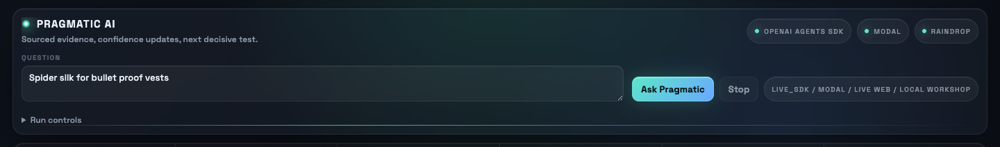
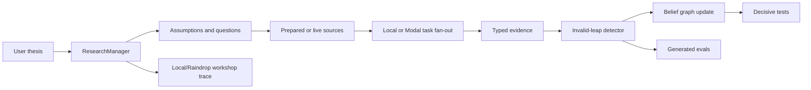

# Pragmatic



Pragmatic is a research-state workbench for testing whether a technical thesis is actually supported by evidence.

It decomposes a thesis into assumptions, retrieves prepared or live sources, extracts typed evidence, detects invalid inference leaps, updates a belief graph, proposes decisive tests, and turns its own reasoning failures into evals. The goal is not to generate a more polished report. The goal is to expose the current structured research state: what would need to be true, what evidence exists, where the chain breaks, and what test would reduce uncertainty fastest.

## Why This Exists

Autonomous research demos can sound convincing while quietly mixing together very different claims:

- retrieval or reasoning support
- proxy benchmark performance
- cross-domain transfer
- prospective real-world validation

Pragmatic keeps those surfaces separate. It is built to make assumptions, source-backed evidence, proxy evidence, invalid leaps, confidence updates, and next tests visible in one inspectable loop.

## Current Status

- Deterministic prepared-corpus research loop for local demos and regression tests.
- Realtime Starlette cockpit in `realtime_app.py` with streamed thinking, belief graph updates, worker activity, counters, and a bottom-line verdict.
- Optional live OpenAI Agents SDK orchestration with explicit opt-in guardrails.
- Optional Modal-backed remote fan-out for research tasks.
- Local Raindrop Workshop-compatible trace bundles by default, with optional hosted Raindrop writes.
- CI-ready regression gates with a committed eval baseline.

## Quickstart

Pragmatic requires Python 3.11 or newer.

```bash
python3 -m venv .venv
source .venv/bin/activate
python --version  # should be 3.11 or newer
python -m pip install -e ".[dev]"
python -m pragmatic demo-smoke --fail-on-fail
python -m pytest
```

If you already have a Python 3.11+ environment active, start at the `pip install` step.

For a guided offline run with no API keys or Modal setup, see [docs/playground.md](docs/playground.md).

## Run The Realtime Cockpit

```bash
python -m uvicorn realtime_app:app --host 127.0.0.1 --port 8501
```

Open [http://127.0.0.1:8501](http://127.0.0.1:8501).

The realtime app opens on an offline prepared-source run by default. Live SDK, live web search, Modal, and hosted Raindrop paths are opt-in.

In the realtime and Streamlit UIs, `Use Modal` and `Use Raindrop` are explicit switches and both default to off. With `Use Raindrop` off, Pragmatic still writes local Workshop-compatible artifacts; it just does not attempt hosted Raindrop SDK writes.

## API Vs Codex Harness

Pragmatic does not depend on the Codex CLI or a Codex benchmark harness. The live model paths use the OpenAI Python SDK and OpenAI Agents SDK from the normal public package dependencies:

- `openai-agents` for live agent orchestration through `Runner.run_streamed`.
- `openai` for live web source acquisition through the Responses API `web_search` tool.
- `OPENAI_API_KEY` for authentication.

The command named `live-run-harness` is Pragmatic's own guardrailed API harness. In dry-run mode it validates settings without making an API call. In live mode it requires `--live --allow-live-sdk` and `OPENAI_API_KEY`.

## Search And Ranking Limits

Search and ranking are intentionally lightweight in this prototype.

For prepared corpora, Pragmatic scores every source against every research question with deterministic term overlap. The score compares normalized terms from the question/query against source title, source type, citation, evidence scope, tags, and text. It adds a small tag-overlap bonus and a small source-type bonus for papers, benchmarks, reviews, standards, and government sources. Sources are ordered by their best score across open questions.

For live web mode, Pragmatic asks the OpenAI Responses API `web_search` tool to return a small source pack, preferring primary papers, standards, government or testing bodies, reviews, credible technical sources, and contradictory or limiting evidence. Those normalized web sources then pass through the same lightweight scoring layer.

This is not yet a sophisticated deep-research or ranking system. It does not perform citation-graph analysis, semantic vector retrieval, multi-hop search planning, source authority modeling, systematic literature review, or learned reranking. The score is a transparent relevance signal for demo traceability, not a claim that the best or most authoritative evidence has been found.

## Useful Commands

List curated demo scenarios:

```bash
python -m pragmatic demo-scenarios
```

Run the deterministic regression gates:

```bash
python -m pragmatic eval-suite --fail-on-fail
```

Compare current behavior against the committed eval baseline:

```bash
python -m pragmatic check-eval-baseline eval_baselines/default_v1.json --fail-on-regression
```

Run the guarded live-path harness in dry-run mode:

```bash
python -m pragmatic live-run-harness
```

Run a live OpenAI API-backed path with prepared sources:

```bash
export OPENAI_API_KEY="..."
python -m pragmatic live-run-harness \
  --live \
  --allow-live-sdk \
  --source-mode prepared \
  --observability local
```

Run live OpenAI API-backed source acquisition with web search:

```bash
export OPENAI_API_KEY="..."
python -m pragmatic live-run-harness \
  --live \
  --allow-live-sdk \
  --source-mode web \
  --allow-live-web-search \
  --observability local
```

Run the no-key spider-silk prepared-corpus demo:

```bash
python -m uvicorn realtime_app:app --host 127.0.0.1 --port 8501
```

Then open [http://127.0.0.1:8501](http://127.0.0.1:8501) and click `Ask Pragmatic`. For a CLI smoke version of the same public-safe path, run `python -m pragmatic demo-smoke --fail-on-fail`.

Run the older Streamlit surface:

```bash
python -m streamlit run app.py
```

## Optional Live Integrations

Copy `.env.example` if you want a local reminder of the optional environment variables. Do not commit real secrets.

```bash
cp .env.example .env
```

Live integration knobs:

- `OPENAI_API_KEY`: required for live OpenAI Agents SDK execution and live web source search.
- Modal CLI authentication: required only when using `--execution-backend modal` or the `Use Modal` UI switch.
- `RAINDROP_WRITE_KEY`: optional hosted Raindrop writes when using `--observability raindrop` or the `Use Raindrop` UI switch. Local workshop bundles work without it.
- `PRAGMATIC_PREWARM_MODAL=1`: optional Modal prewarm on app startup.

Commands that make live model calls require explicit flags such as `--live`, `--allow-live-sdk`, and, for live web source acquisition, `--source-mode web --allow-live-web-search`.

## Architecture



Core modules:

- `src/pragmatic/research_loop.py`: canonical deterministic research loop.
- `src/pragmatic/agents.py`: OpenAI Agents SDK facade, scripted orchestration, and guarded live execution.
- `src/pragmatic/execution.py`: local and Modal-shaped task execution backends.
- `src/pragmatic/source_search.py`: prepared-source and opt-in live web source acquisition.
- `src/pragmatic/raindrop_client.py`: local and hosted observability adapters.
- `src/pragmatic/eval_suite.py`: regression gates for the evidence-boundary behavior.
- `realtime_app.py`: realtime browser cockpit.
- `app.py`: older Streamlit app.

## Demo Scenarios

The scenario pack in `src/pragmatic/demo.py` includes:

- `live_full`: live SDK, live web evidence acquisition, Modal execution, and local Workshop observability.
- `core_loop`: prepared corpus, scripted SDK-style specialist steps, and local execution.
- `modal_fanout`: remote research fan-out when Modal is configured.
- `spider_silk_prepared`: offline source pack tuned to show the tensile-toughness proxy boundary.
- `failure_replay`: replay story where a proxy-evidence failure becomes an eval and changes confidence.
- `live_guarded`: dry-run-first live SDK readiness path.

## Evidence Boundaries

Prepared corpora in `src/pragmatic/data/` are demo and regression fixtures, not proof that the underlying scientific claims are true.

Retrieval scores are relevance heuristics only. Evidence strength is decided later by extraction, cross-source checking, invalid-leap detection, verifier tasks, and belief updates, and even those are prototype guardrails rather than a complete scientific review.

The spider-silk prepared demo is intentionally skeptical: it treats tensile toughness as proxy evidence for ballistic vest performance, flags the unsupported application leap, and asks for a standards-relevant NIJ Level IIIA / V50 panel comparison against an aramid control.

## Repository Map

- `src/pragmatic/data/`: committed prepared source packs included in package builds.
- `docs/playground.md`: no-key local walkthrough for first-time visitors.
- `docs/hackathon_demo_script.md`: recorded-demo run order and fallback artifacts.
- `eval_baselines/default_v1.json`: committed known-good eval baseline.
- `tests/`: deterministic unit and integration tests.
- `.github/workflows/ci.yml`: GitHub Actions test, compile, and eval-baseline check.
- `artifacts/pragmatic-header-*.png`: public README/demo imagery.

Generated run artifacts are written under ignored local directories such as `.pragmatic/`, `.thesisgraph/`, and `.playwright-mcp/`.

## Public Readiness

This repo is intended to be safe to show publicly as a prototype. Before making a public release, review [docs/publication_checklist.md](docs/publication_checklist.md).

Pragmatic is licensed under the Apache License 2.0. See [LICENSE](LICENSE).
